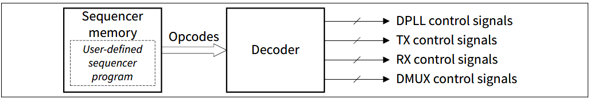
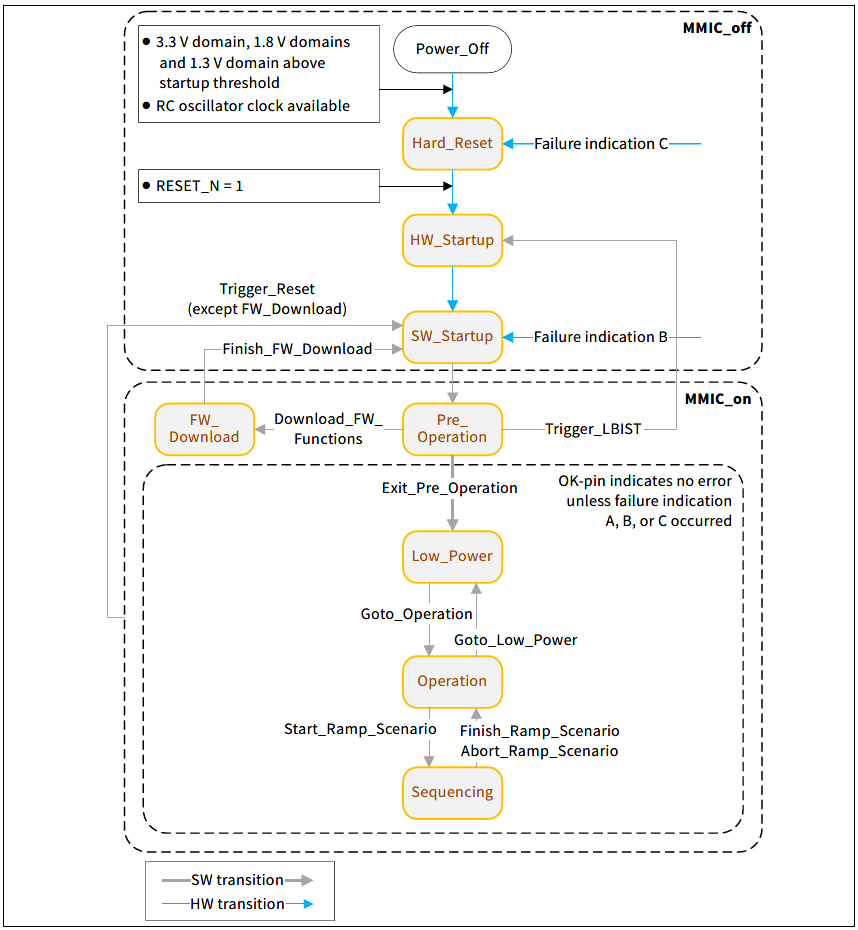

@page About_CTRX About CTRX Device
The device is a fully integrated radar transceiver operating in the frequency band between 76 and 81 GHz. It is a state-of-the art radar chip featuring 4 transmit channels, 4 receive channels, a low noise ultra-fast Digital Phase Locked Loop (DPLL), radar frequency ramp signal generation, analog baseband processing line, filtering and amplification, Analog to Digital Conversion (ADC), sample rate reduction filters, and DC offset cancellation - all within a single chip.

@note This page is intended to give a brief introduction to the CTRX device for a detailed description please refer to the User Manual and Datasheet.

@section Application_interfaces Application interfaces
The following list describes the hardware interfaces that are available at the ball out of the device used for common application purposes:

- RF Transmitter  
Output of the generated RF transmit signals.

- RF Receiver  
Input of the received RF signals.

- Serial peripheral interface (SPI)  
The device acts as SPI-slave and provides access to firmware functions for configuration, control and monitoring
purposes:

    - Download RAM firmware
    - Configure ramp sequences
    - Start and stop ramp execution
    - Trigger monitoring and calibration and read-back results
    - Read status information
    - Configure internal modules (e.g. receiver, transmitter, monitoring, clock generation, etc.)

- High speed radar interface (HSRIF) IEEE LVDS / MIPI DPhy/CSI-2 for sampled RX data  
Serialization and transmission of the sampled IF data for each RX channel. 

- Reference clock interface (XIN / XOUT)  
An internal RC oscillator is available inside CTRX which is intended to be used during start-up only. For radar operation a proper clock signal with an external crystal is needed in order to generate the reference clocks.

- Clock output for external devices (25 MHz)  
CTRX provides a clock output as reference for external devices such as a microcontroller.

- Power supply (PSUP)  
All supply domains that need to be provided to the chip by external power sources.

- OK pin  
Communication of failed monitoring evaluations, which allows a quick reaction by the system integrator.

- Digital multiplexer (DMUX)  
Enables to select alternative functions for external pins in order to provide a more flexible HW-SW interface. Mainly to communicate internal digital states and to apply external digital trigger signals.

- Reset (RESET_N)  
Low active external pin reset with internal pull-down resistor

The below figure shows the block diagram of the device.

@section Subsystems

The CTRX consists of the following subsystems:
- Transmitter : Generates the Transmitted RF signal defined by the application
- Receiver : Receives the RF signal, mixes, filters and converts the signal to sent to HSRIF
- Sequencer : Generates user-defined ramp scenarios

@subsection Sequencer 
The main purpose of the sequencer subsystem is to generate user-defined ramp scenarios.
The sequencer subsystem consists of a 64 kB memory, which holds the user-defined sequencer program, and a decoder, which generates from the sequencer program time accurate control signals for the DPLL, TX- and RX-subsystem. 
Additionally, the decoder can also trigger time accurate firmware command calls, which could be part of the user-defined ramp scenario.

Ramp scenario is generated by a sequencer program fully defined by the system integrator, which is stored in the sequencer memory and executed by the sequencer subsystem.
Typically it consists of at least one ramp sequence, but may also consist of more than one ramp sequence. In addition a ramp scenario may also contain time phases for calibration, monitoring or hardware setup (e.g.re-configuration of RX output sample rate) before or after a ramp sequence or between two ramp sequences. This can be done by including FW command calls in the sequencer program.

@section Firmware_functions  Firmware functions in RAM
The MMIC can operate and execute the FW from integrated ROM or alternatively also from integrated RAM. When operating from RAM the FW needs to be downloaded to the MMIC prior to operation once upon power-on, hard reset and depending on the error also after soft reset.

A brief description of the operating the device using these firmware function is provided at @ref Operating_CTRX. For Detailed description please refer to the user manual.

@section Device_configuration Device Configuration

@subsection State_diagram State Diagram
The CTRX8191_B11 operates in predefined states with dedicated transitions between them. The below figure describes the states and the transitions between them.

- Power_Off  
In this state the device is powered down and all functionality is disabled.

- Hard_Reset  
In this state the device is powered up but the external hard reset is still not released (RESET_N pin is held at low level).

- HW_Startup  
In this state the LBIST is executed if a LBIST request is pending, otherwise immediate transition to next state.  

- SW_Startup   
In this state some basic initialization is done.

- Pre_Operation   
In this state the SPI bus is ready for communication and it is possible to change the default settings by using firmware command Initialize().

- FW_Download   
In this state additional firmware functions can be loaded into RAM and existing firmware functions from ROM can be replaced by an updated version in the RAM.

- Low_Power   
In this state most modules are disabled to save power.

- Operation   
In this state the DPLL, LO distribution and all RX channels are activated.  

- Sequencing  
In this state the sequencer program is executed. Nevertheless a few dedicated SPI commands are still available.
