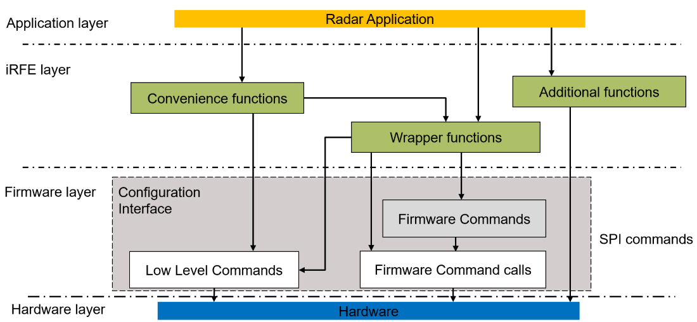

@page About_iRFE_Driver About CTRX iRFE Driver

@section Introduction_iRFE Introduction to iRFE
The CTRX iRFE driver provides an interface for the CTRX MMIC. It provides abstraction for the SPI commands and the hardware described in the User manual for the device.
The driver provides an interface to the SPI commands for CTRX provided by the firmware.
The driver also provides an interface to configure and execute firmware commands for the CTRX.
The detailed description of Individual Firmware commands and their settings can be found in the CTRX user Manual.

@subsection Scope Scope of the Driver
- The driver allows control of the Radar operation of the CTRX from Aurix.
- The driver provides low level abstraction to the CTRX hardware details.
- The driver provides support for Rapid prototyping for implementation.
- The driver provides mid level abstraction of CTRX functionality via wrapper functions of firmware commands.
- The driver provides mid level abstraction for firmware commands via convenience functions.

@subsection Non_scope Non-scope of the driver
- To provide high level abstraction of Radar operation.
- To provide advanced signal processing of the Radar data.

@subsection Development_requirements Requirements to develop radar application using the driver
- Hightech TriCore Entry Tool chain
- iLLD V1.0.1.x.x Aurix TC3xx Driver or higher
- CTRX evaluation board with Aurix TC3xx microcontroller

@section Overview Overview of the driver

The below diagram showcases the simplified architecture for the iRFE driver along with the interface to the layers above and below it such as the application layer and the firmware layer:




The iRFE driver itself is platform independent and provides the user with the following functionalities:

@subsection Access_config_interface Access to the configuration interface
The CTRX is configured and controlled using the configuration interface which is briefly described at @ref Configuration_interface. Access to this configuration interface forms the core functionality of the driver. Through the commands made available by the configuration interface CTRX the user could create the required Radar Application.

The interface provides access to the following types of commands:
    - @ref Low_level_commands :
        These are the basic commands available from the firmware to do houskeeping tasks such as read previous SPI response or trigger a reset. These driver provides an interface to call these commands. Details of individual commands are briefed in the sub-page @ref Low_level_commands.
    - @ref Firmware_command_calls :
        These are commands which define the execution type or configuration of the firmware commands available for CTRX. These commands define whether a Firmware command is executed directly, executed using a handle or if the Firmware command is only configured for a Handle. The driver provides an interface to these commands. Details of individual commands are briefed in the sub-page @ref Firmware_command_calls.
    - @ref Firmware_commands_8191_A11, @ref Firmware_commands_8191_B11, @ref Firmware_commands_8188 :
        These are high-level commands available in the firmware which provide functionality to configure and execute radar application on each CTRX firmware version. The iRFE driver provides an interface to these firmware commands through the wrapper functions. Details of individual commands and the type of wrapper functions available for each command are briefed in the linked pages.
        - @ref Wrapper_functions :
            The section 4.4.2 of the CTRX user manual describes the creation of an SPI message using the Firmware commands calls and the Firmware commands. The iRFE driver simplifies this creation for the users. The use of firmware command and firmware command calls is simplified by wrapping them together in individual wrapper functions. The iRFE driver provides the user with wrapper functions for each firmware command and firmware command call combination. This allows flexible usage of the firmware commands as per the needs of the user.

            The wrapper functions also provide asynchronous function implementations for each firmware command. Each firmware command can be called asynchronously using the wrapper ending with '_start' and finshed using the wrapper ending with '_finish'. Details of the wrapper functions available for firmware commands are provided at @ref Wrapper_functions and the overall list of all combinations of wrapper functions are available at @ref IfxRfe_FirmwareCommands.c.


The driver provides functions to access each of the command types described in the configuration interface.

@subsection Error_macros Error Macros
The iRFE driver also implements for convenience error macros which evaluate the error return type such as @ref IFXRFE_RETURN_ON_ERROR and @ref IFXRFE_CLEAN_RETURN_ON_ERROR. The macros can ideally be called to evaluate the return of each function using iRFE. These macros are already used within each of the wrapper functions. Below code example showcases an implementation of the wrapper function @ref IfxRfe_executeCalibration with these error macros.

```c
error_t IfxRfe_executeCalibration(IfxRfe_executeCalibration_t req, IfxRfe_executeCalibrationResult_t *res)
{
    RETURN_ON_NOT_INITIALIZED();

    IfxRfe_payload_t payload = {{0}, 0};
    IFXRFE_RETURN_ON_ERROR(_executeCalibrationSerialize(req.detail_result, req.calib_sub_func_id, req.tx_ch_pow_idx, req.ref_temp_idx, req.limit_temp, &payload));

    // SPI call
    IfxRfe_executeResult_t spi_res;
    IFXRFE_RETURN_ON_ERROR(IfxRfe_spiCmd_executeDirectly(IFXRFE_FW_COMMAND_EXECUTE_CALIBRATION, payload.payload, payload.len, &spi_res));

    // Check and transform response parameters
    IFXRFE_RETURN_ON_ERROR(_executeCalibrationParse(&spi_res, res));
    return IFXRFE_E_SUCCESS;
}
```

@subsection Conv_functions Convenience functions
The iRFE driver provides the user with convenience functions which are briefly described at @ref Convenience_functions. These functions support the users in quick bring up of the radar application.


@subsection Add_functions Additional functions

Some additional platform dependent functionalities provided by the driver are:

- GPIO wrapper (used with Aurix iLLD platform) @ref GPIO_Wrapper
- SPI wrapper (used with Aurix iLLD platform) @ref SPI_Wrapper
