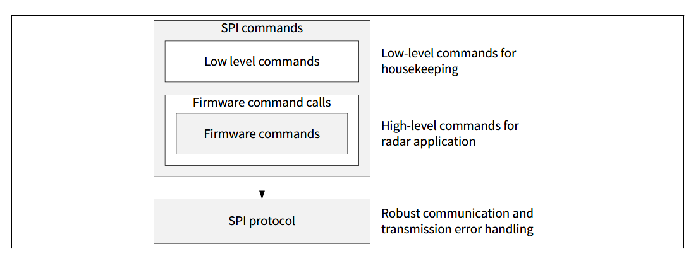
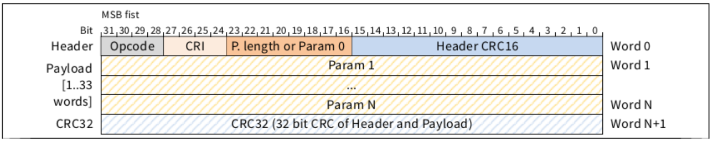
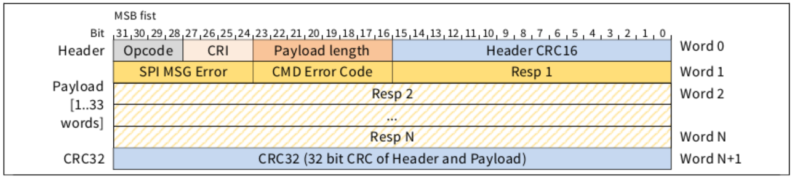

@page Configuration_interface CTRX Configuration interface

The configuration and control of the CTRX MMIC is done using standard 4 wire SPI slave interface and additional flow control pin RFT(ready for transfer).

The application controller uses the SPI interface to send SPI commands to configure and control the MMIC. The SPI commands trigger MMIC firmware functions that:
- support download of additional firmware functions
- download ramp scenario configurations
- execute miscellaneous configuration and control tasks such as calibration and monitoring

The simplified programming model for the CTRX firmware is shown below:

### Low level commands
Housekeeping tasks, like triggering a device reset or a read-back of the last SPI response are available through low-level SPI commands. Details of the individual commands are further described at @ref Low_level_commands

### Firmware command calls
Configuration or execution of high-level firmware commands. This can be a single firmware command or a sequence of multiple firmware commands defined with batches. Details of the individual commands are further described at @ref Firmware_command_calls

### Firmware commands
Configuration and execution of the radar application is done with high-level firmware commands. Details of the individual commands are further described at following subpages: @ref Firmware_commands_8191_A11, @ref Firmware_commands_8191_B11, @ref Firmware_commands_8188

@section SPI_Prtocol SPI protocol
The SPI communication can be started by the system controller by pulling the Slave select to low, providing an SPI clock at SCLK and a serial data stream at SI.

Any data transferred over SPI is organized in frames, where a frame consists of:
1. the falling edge of SS
2. the transfer of one or more words, the first of which is the header and all of which have exactly 32 bits
3. the rising edge of SS.

Any frame consists of exactly one message from the MCU to the MMIC and a second message in the opposite direction from MMIC to the MCU. Messages are always left aligned in the frame, i.e. the frame's first word is always also both messages' first word. A frame can be longer than either message.

@subsection RFT RFT: Ready for Transfer
A Ready for Transfer (RFT) signal is used by the MMIC to indicate to the MCU whether or not the MMIC is ready for the transfer of a frame. The MMIC will set RFT to high level whenever it is ready for an SPI transfer. The MCU can transfer exactly one frame before it needs to wait for the RFT to be at high level again.

@note Whenever the SS is pulled low, the RFT is cleared. In order to avoid problems, only de-assert the reset pin on the MMIC after the SPI interface is initialized (MISO/MOSI/SCLK/SS are set to their default/idle value).

@subsection MCU_MMIC Message from MCU to MMIC
A message transferred from the MCU to the MMIC contains the information as shown in the figure below.

- The opcode indicates the type of command and decides whether a command is a multi-word command.
- The cyclic running index (CRI) is used to relate a response to a command: the MMIC will echo the CRI to the MCU in the response's header.
- CRC16 : CRC calculated over the header (CCITT CRC16)
- CRC32 : CRC calculated over header and payload (IEEE 802.3 Ethernet CRC32). For messages without any payload this CRC is not used.

@subsection MMIC_MCU Message from MMIC to MCU
A message transferred from the MMIC to the external microcontroller (MCU) contains the information as shown in figure below.

@subsection CRC Cyclic redundancy check (CRC)
For CRC calculation the following configuration as described in the table has to be used. Input and output reflection disabled means,that CRC calculation is done with MSB first.

| Parameter | CCITT CRC16 | IEEE 802.3 Ethernet CRC32 |
| :-------------- | :------------ | :------- |
| Polynomial | 0x1021 | 0x04C11DB7 |
| Initial value  | 0xFFFF | 0xFFFFFFFF |
| Final XOR  | 0xFFFF  | 0xFFFFFFFF |
| Input reflection  | Disabled  | Disabled |
| Output reflection  | Disabled  | Disabled |
