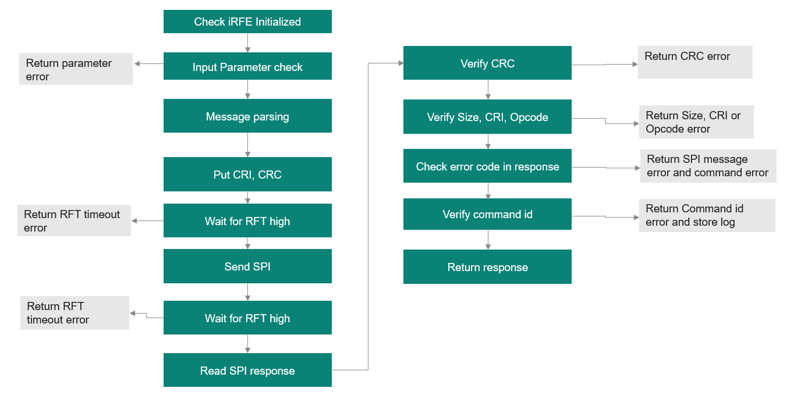

@page Error_Handling Error Handling

The iRFE driver provides error handling in the following ways:

- Error codes are returned in case of errors for individual function and command calls. These error codes are defined in @ref Ifxrfe_ErrorDefinitions.h
- Error log messages can be stored by the user with formatting using the error logging functionality provided by @ref errorLogFmt, @ref warningLogFmt and @ref infoLogFmt. The Error logs can be saved directly without additional formatting using @ref errorLog, @ref warningLog and @ref infoLog.

The following code snippet provides an example of logging callbacks implementation using iRFE. The below section showcases the methods to write/read to a serialPort buffer.

\snippet ./sources/library/Logger.c Logger Usage

These methods can then be used in the application using the iRFE struct @ref IfxRfe_logCallbacks_t as shown in the below example code.

```c
IfxRfe_logCallbacks_t logCallbacks;
logCallbacks.infoLog    = Logger_InfoLog;
logCallbacks.warningLog = Logger_WarningLog;
logCallbacks.errorLog   = Logger_ErrorLog;

IfxRfe_init(boardDefinition->devId, spiFncs, pinDefinitions, gpioFncs, timeFncs, logCallbacks);
```

@subsection CTRX_FW_error_handling CTRX firmware errors and their handling

CTRX provides firmware commands to allow error handling of the firmware errors. These are firmware commands: Handle_Error() to handle error and Handle_Reset_Reason() to know reset reason status and clear it if requested. Please refer to the User manual section 4.5 Error status for further details of these firmware errors and commands. These firmware commands can be accessed via iRFE through @ref IfxRfe_handleError and @ref IfxRfe_handleResetReason.

@note The firmware error handling is not dependent on the iRFE driver and is fixed in firmware. The iRFE driver only provides access to the firmware commands defined for error handling.

@subsection Example_error_handling Example of Error Handling in iRFE
The iRFE driver implements error handling for its wrapper function in the following steps as described in the diagram below.



The wrapper function @ref IfxRfe_configureDmux() is taken as an example and the steps are provided in detailed in the below table.

| Step | Code example | Description |
| :-------------- | :------------ | :------- |
| Check if iRFE is not initialied | <pre lang="c"> RETURN_ON_NOT_INITIALIZED(); </pre> | Returns error code IFXRFE_E_NOT_INITIALIZED if IRFE is not initialized |
| Serialize the command payload parameters | ` _configureDmuxSerialize(config_mask, dmux1_alt_signal, dmux1_dir, dmux1_pulse_duration_ext, dmux2_alt_signal, dmux2_dir, dmux2_pulse_duration_ext, dmux3_alt_signal, dmux3_dir, dmux3_pulse_duration_ext, &payload); ` | Call the serialize function to serialize the command payload parameters |
| Check input parameters (in serialize) | `CHECK_PARAM_GREATER(config_mask, 7);` | Returns error code IFXRFE_E_INVALID_PARAMETER if any parameter is out of range |
| Check return of serialize function | `IFXRFE_RETURN_ON_ERROR(_configureDmuxSerialize(config_mask, dmux1_alt_signal, dmux1_dir, dmux1_pulse_duration_ext, dmux2_alt_signal, dmux2_dir, dmux2_pulse_duration_ext, dmux3_alt_signal, dmux3_dir, dmux3_pulse_duration_ext, &payload));` | IFXRFE_RETURN_ON_ERROR evaluates the return of the function call and returns it, if it is not 0 |
| Call SPI command for execute directly| `IfxRfe_spiCmd_executeDirectly(IFXRFE_FW_COMMAND_CONFIGURE_DMUX, payload.payload, payload.len, NULL);` | Call SPI command function for execute directly |
| Call and Check for errors on serialize function to build the SPI command| ` IFXRFE_RETURN_ON_ERROR(_executeDirectly_serialize(command_id, params, params_count, &cmd));`| Initialize command, add payload, CRI and CRC to build SPi command. <br />IFXRFE_RETURN_ON_ERROR evaluates the return of the function call and returns it, if it is not 0 |
|Transmit command and receive response in half duplex mode and check for errors|` IFXRFE_RETURN_ON_ERROR(SpiSendReceive(&cmd, &rsp));`|Transmit SPI message and receive back response|
|wait for RFT (in SpiSendReceive)|`IFXRFE_RETURN_ON_ERROR(IfxRfe_waitForRftPin(IFXRFE_RFT_TIMEOUT_DEF));`|Wait for the RFT pin to be set. Return IFXRFE_E_TIMEOUT if pin was not set in the requested time |
|SPI command write| `IFXRFE_RETURN_ON_ERROR(Wrapper_SpiWrite(command->_actualLen, command->_buffer, false));` | SPI write |
|wait for RFT (in SpiSendReceive)|`IFXRFE_RETURN_ON_ERROR(IfxRfe_waitForRftPin(IFXRFE_RFT_TIMEOUT_DEF));`|Wait for the RFT pin to be set. Returns IFXRFE_E_TIMEOUT if pin was not set in the requested time |
|Get header and check header CRC|<code>IFXRFE_CLEAN_RETURN_ON_ERROR(Wrapper_SpiTransfer(1, command->_buffer, response->_buffer, true), ResetKeepSel()); <br /> IFXRFE_CLEAN_RETURN_ON_ERROR(CheckResponseHeaderCrc(response), ResetKeepSel());</code>|returns IFXRFE_E_CRC16 if crc does not match |
| Get payload data and check payload CRC|<code>IFXRFE_CLEAN_RETURN_ON_ERROR(Wrapper_SpiTransfer(transferLen, &command->_buffer[1], &response->_buffer[1], false), ResetKeepSel()); <br /> IFXRFE_RETURN_ON_ERROR(CheckResponsePayloadCrc(response));</code>| returns IFXRFE_E_INVALID_CRC32 if the payload does not match|
| Check response for errors |` IFXRFE_RETURN_ON_ERROR(_checkResponseForErrors(EXECUTE_DIRECTLY_MIN_LENGTH, GET_OPCODE(cmd._buffer[0]), &rsp));`|check size and opcode for invalid responses and return error codes: IFXRFE_E_INVALID_SIZE,IFXRFE_E_CRI_MISMATCH,  IFXRFE_E_OPCODE_MISMATCH respectively |
| Check error codes on payload of response (in _checkResponseForErrors)|`IFXRFE_CLEAN_RETURN_ON_ERROR(GetPayloadError(rsp, &temp), errorLogFmt("payload error code 0x%02X, value 0x%02X", ret, temp));`| Returns error code for SPI message error and command error: IFXRFE_E_SPI_MSG_ERROR and IFXRFE_E_COMMAND_ERROR respectively|
| Check if command code matches| <pre lang="c"><code>uint8_t receivedCmd = rsp._buffer[1] & 0x000000FF; <br />if (receivedCmd != command_id) <br />{<br />    errorLogFmt("received command id %d does not match sent command id %d", receivedCmd, command_id);<br />    return IFXRFE_E_UNEXPECTED_VALUE;<br />}</code></pre>| If command code does not match, store error log and return error code IFXRFE_E_UNEXPECTED_VALUE |
| Parse execute directly response and return error code| ` return _executeDirectly_parse(&rsp, result);` | parses the response and returns 0 on success |
