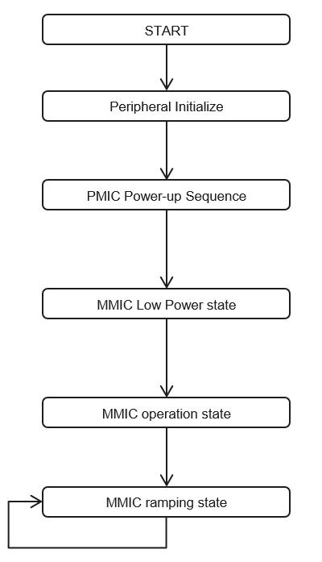

@page Example_page Example Code Description

@section Example1 Example 1 : Infinite Loop Ramp scenario

In this example, CTRX MMIC repeats ramp scenario forever after MMIC bring-up.
TX performance of CTRX such as ramp linearity, phase noise can be measured by executing the example in the radar module. Calibration is executed once and no monitoring is executed. 

| Flowchart | Sequence | Description of the Sequence | Functions/States | iRFE Function used in the sequence |
|:------- | :--------- | :-------------- | :--------- | :------------- |  
| | Peripheral Initialize | Initialize Platform SPI, I2C, Aurix Emem and configure SPI | @ref PlatformI2c_initialize(),  @ref PlatformSpi_initialize(),  @ref AurixEmem_Constructor() ,   @ref PlatformSpi_configure()  | None | 
|^ | MMIC power-up sequence | MMIC power up sequence consists of multiple steps:  1. Power up sequence  2. Trigger LBIST  3. Load ram Firmware  3. Configure MMIC clock  4. Set MMIC Clock   5. Exit Pre-Operation | states:  DAS_POWERUP and DAS_INITIALIZE | Convenience functions:  @ref IfxRfe_ctrxInit(), @ref IfxRfe_loadRamFw()    Wrapper functions:  @ref IfxRfe_triggerLbist(),  IfxRfe_configureMmicClock(), @ref  IfxRfe_initialize_exp(),   @ref IfxRfe_setMmicClock_exp(),  @ref IfxRfe_getVersion(),  @ref IfxRfe_exitPreOperation_exp().    Low Level Commands:  @ref IfxRfe_triggerReset().   Additional Functions:   @ref IfxRfe_readOkPin() | 
|^ | MMIC Low-power | After exiting the Pre-operation state, the MMIC reaches Low power state.  The following operations are performed in this state:  1. Download a Sequencer Program  2. configure ramp scenario  3. Configure DMUX and Digital IO  4. configure transmitter  5. Configure receiver  6. configure start frequency  7. Go to operation | @ref IrfeDemoApp_run() in state:  DAS_INITIALIZE | Wrapper Functions:  @ref IfxRfe_getStatus(),  IfxRfe_configureRampScenario_exp(),  @ref IfxRfe_configureDios(), @ref IfxRfe_configureTxPower(),  @ref IfxRfe_configureRx(), @ref IfxRfe_configureRfFrequency_exp(),  @ref IfxRfe_gotoOperation().   Convenience functions:  @ref IfxRfe_loadSequencerData(), @ref IfxRfe_safeConfigureDmux() | 
|^ | MMIC operation | In this state commands to configure the radar operation are executed.  1. Device Calibration  2. Start Ramp sequence and move to sequencing state| @ref IrfeDemoApp_run() in states:   DAS_CALIBRATE and DAS_SEQUENCE_START  | Wrapper function:  @ref IrfeDemoApp_executeCalibration_AsyncStart(),   @ref IfxRfe_startRampScenario(),   @ref IrfeDemoAppSpecific_executeCalibration_SyncStruct(),   @ref IrfeDemoApp_executeCalibration_AsyncFinish() | 
|^ | MMIC ramping | The transition to sequencing state occurs when Start_Ramp_Scenario() is called  in the operation state.  The transition out of this state to operation state occurs when  Finish_Ramp_Scenario() is called. | @ref IrfeDemoApp_run() in states:  DAS_SEQUENCE_START and DAS_SEQUENCE_FINISH | Wrapper function:  IfxRfe_finishRampScenario_exp() | 

