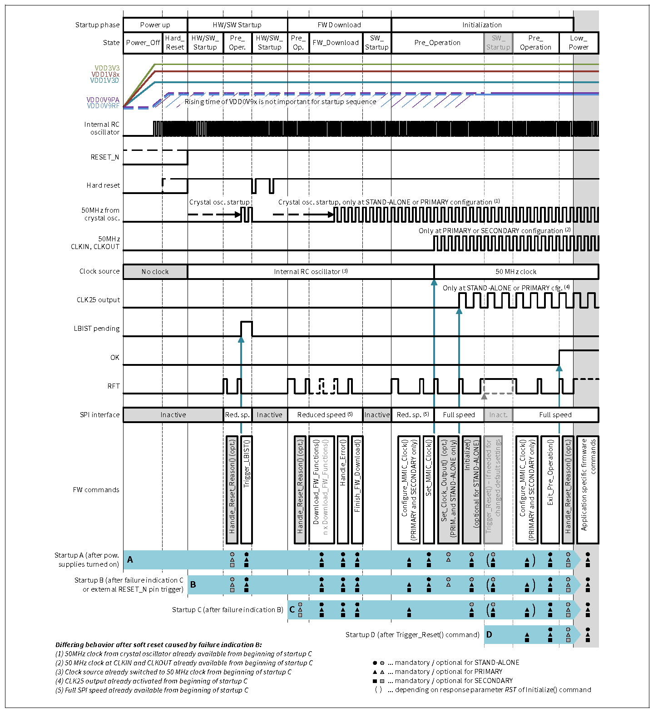

@page Operating_CTRX Operating CTRX

The CTRX operates in predefined states with dedicated transitions between them. The following figure showcases the states and the transitions between them. Please refer to the user manual for detailed descriptions.

To implement a radar operation cycle the CTRX needs to transition through the state mentioned above and reach operation state before a particular ramp scenario can be started in the Sequencing state.

@section Power_up_Initialize Power up Sequence and initializing the MMIC
In order to move from the Power_Off state a power up sequence as defined in the user manual must be performed to power up the MMIC safely.
The power-up sequence and initialization of the CTRX device includes several phases that are shown in the below figure. For a detailed description, please refer to the user manual.

After power-up is successfully done and the Hard reset is removed as per the user manual the CTRX reaches the Pre-Operation state. In this state dedicated SPI commands can be used to initialize the device, this includes the firmware command Download_FW_Functions() which is used for RAM firmware download. The default settings of the device can only be changed in this state using firmware command Initialize().

The iRFE Driver provides multiple options to initialize the device.
1. It provides access functions to individual FW commands such as @ref IfxRfe_initialize, @ref IfxRfe_downloadFwFunctions to accomplish the tasks. The description of individual firmware functions are provided in the following subpages @ref Firmware_commands_8191_A11, @ref Firmware_commands_8191_B11, @ref Firmware_commands_8188.
2. It provides a convenience function @ref IfxRfe_ctrxInit which initializes the CTRX directly by downloading the firmware, initializing clock and setting CTRX to Low Power state.
3. It also provides a convenience function to only load the Ram Firmware using @ref IfxRfe_loadRamFw, while the rest of the steps can be performed using firmware commands.

@note CTRX8191_B11 requires the RAM firmware to be downloaded before the clock configuration.

@section Radar_operation Radar Operation
The CTRX provides a very high configurability to enable the user to easily adapt the device behavior to the required system configuration. Below is one such example of the configuration flow which starts at Low_power_state. Please refer to the user manual for further details.

@subsection Low_power_Config Low power State and configuration of MMIC
After exiting the Pre-operation state by using the Firmware command Exit_Pre_operation() @ref IfxRfe_exitPreOperation, the MMIC reaches Low power state. In this state configurations required before going to operation are performed.

1. Download a Sequencer Program into RAM. The iRFE driver provides a convenience function for the users to load the sequencer data into the sequencer memory using @ref IfxRfe_loadSequencerData. It also provides the interface to user to write and read sequencer memory through SPI to make individual changes if required via @ref IfxRfe_writeSequencerMemory and @ref IfxRfe_readSequencerMemory.
2.Load Sequencer configuration using firmware command Configure_Ramp_Scenario() @ref IfxRfe_configureRampScenario_exp.
3. Configuration of the receiver using the firmware command Configure_RX() @ref IfxRfe_configureRx.
4. Configuration of the transmitter using the firmware command Configure_TX_power() @ref IfxRfe_configureTxPower.
5. Configuration of the start frequency using the firmware command Configure_RF_Frequency() @ref IfxRfe_configureRfFrequency to set the RF frequency to the start frequency of the first ramp.
6. Optional: Configure the digital multiplexer using the firmware command Configure_DMUX() @ref IfxRfe_configureDmux. The iRFE driver provides a convenience function to safely configure DMUX using @ref IfxRfe_safeConfigureDmux.
7. Execute calibration of BBADC and RXGain using firmware command Execute_Calibration() @ref IfxRfe_executeCalibration.
8. Transition into operation state using the firmware command Goto_operation() @ref IfxRfe_gotoOperation.

@subsection Operation Going to Operation(before sequencing)
The MMIC can be transitioned from Low Power State to Operation state using the Firmware command Goto_operation() @ref IfxRfe_gotoOperation. In this state all SPI commands which are needed to configure the device for the radar operation can be executed.

1. Check the temperature of the device using the firmware command Get_Temperature() @ref IfxRfe_getTemperature.
2. Device (re-)Calibration using firmware command Execute_Calibration() @ref IfxRfe_executeCalibration. Can be skipped if the temperature difference since last calibration is small enough.
3. Set the TX output using firmware command Set_TX_Output() @ref IfxRfe_setTxOutput.
4. Start the execution of a ramp scenario using firmware command Start_Ramp_Scenario() @ref IfxRfe_startRampScenario.

@subsection Sequencing Sequencing state
The transition to sequencing state occurs when the firmware command Start_Ramp_Scenario() is called in the operation state. This can be done using iRFE via @ref IfxRfe_startRampScenario_exp. In this state the radar frequency ramp sequences are running.
1. Optional: Calibration, monitoring or reconfiguration of RX channels between ramp sequences with firmware commands that have been pre-defined in the sequencer program.
2. The transition out of this state to operation state occurs when one of the two commands are called: Finish_Ramp_Scenario() or Abort_Ramp_Scenario(). These can be called via iRFE using @ref IfxRfe_finishRampScenario_exp or @ref IfxRfe_abortRampScenario_exp.

@subsection Operation_post_sequencing Operation(after sequencing)
1. Device monitoring using the firmware command Execute_Monitoring() @ref IfxRfe_executeMonitoring
2. Check error status of the MMIC using firmware command Handle_Error() @ref IfxRfe_handleError and optionally check the detailed results of the the monitoring routines using firmware command Get_Results()
3. Transition to Low_Power_State using firmware command Goto_Low_power() @ref IfxRfe_gotoLowPower.

@subsection Low_power_second_cycle Low power (subsequent application cycles)
The next application cycle starts depending on the use case, for example with firmware command Goto_operation() to restart with @ref Operation.

@section Power_down Power Down Sequence
The MMIC can be powered down in a controlled manner from any MMIC_on state, please refer to the user manual for detailed instructions.
